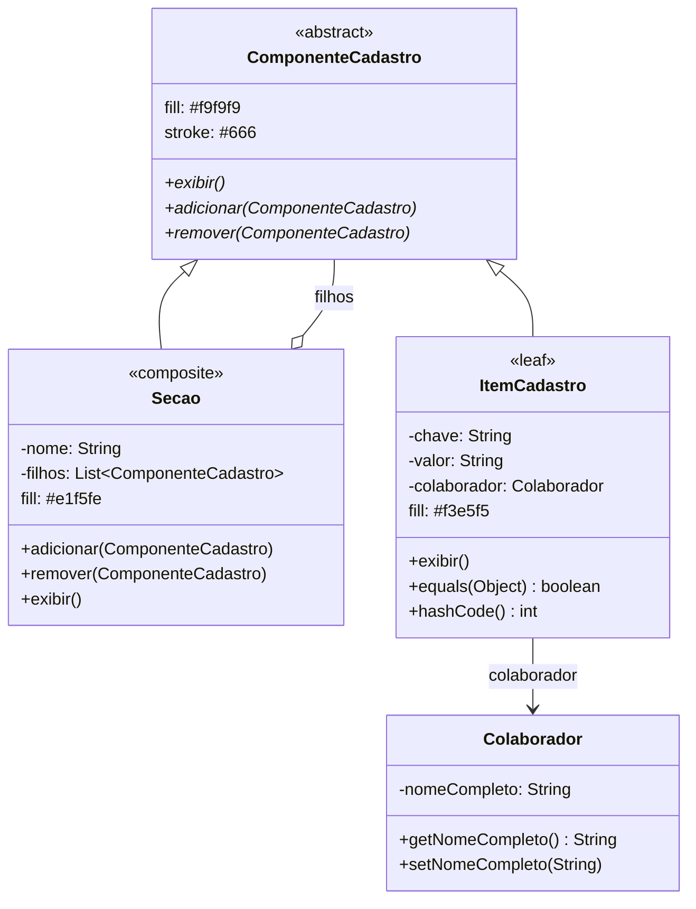

# 📌 Sistema de Cadastro de Colaborador (Com Padrão Composite)

## Grupo
DAVI HENRIQUE TEIXEIRA DE BARROS
FERNANDO DAVILA LINS BEZERRA CAVALCATI FILHO
RHONNYE WENDELL LOURENCO SOARES MARTINS
RODRIGO VERISSIMO DA SILVA
VINICIUS GERMANO DE BARROS

## 📝 Descrição
Este projeto implementa um **sistema de cadastro de colaborador** utilizando o **padrão de projeto Composite**. Ele permite estruturar seções, subseções e itens de forma hierárquica e uniforme, facilitando a manutenção e a expansão do sistema.


## 📂 Estrutura de Arquivos
- **ComponenteCadastro.java** → Interface comum para seções e itens.
- **Secao.java** → Classe Composite que pode conter outras seções ou itens.
- **ItemCadastro.java** → Classe Folha representando um campo simples (ex: Email, CPF).
- **Colaborador.java** → Classe raiz que representa o colaborador.
- **Main.java** → Classe principal com exemplo de uso.


## 🚀 Funcionalidades
- Adicionar/remover seções e itens dinamicamente.
- Exibir a estrutura hierárquica completa do cadastro.
- Tratar seções e itens de forma uniforme (mesma interface).
- Demonstrar remoção dinâmica (ex: dependente removido).

## ⚙️ Como Executar
```bash
javac Main.java
java Main
```

## 📐 Diagrama UML

